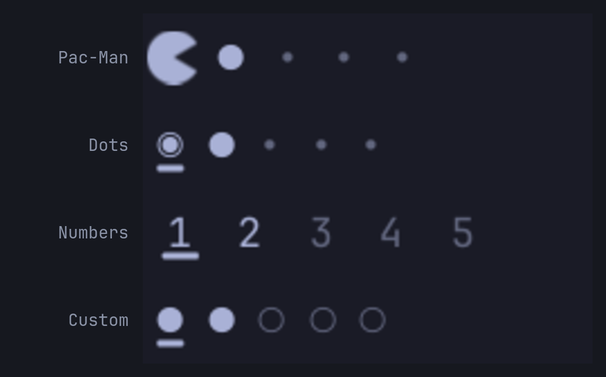

# Glyph Workspaces

A drop-in replacement for Omarchy's built-in workspace indicators, with a
Pac-Man who walks to the workspace you switch to and eats the pellets on the
way.



Four styles: **Pac-Man**, **Dots**, **Numbers** (what the built-in widget
does), and **Custom glyphs** (your own two characters). Clicking a workspace
switches to it, the same as the built-in.

No runtime dependencies beyond Omarchy itself and a Nerd Font (already part of
a standard Omarchy install): no network access, no install hooks, no sudo.
Pac-Man and the ghost are drawn, not glyphs, so they stay crisp at any bar size
and follow your theme like every other mark in the bar. The dev tooling under
`tools/` additionally needs Node.js, which is not needed to install or use the
plugin.

## Install

```sh
omarchy plugin add https://github.com/SmoothPixels/glyph-workspaces.git --enable
omarchy plugin disable omarchy.workspaces
```

`omarchy.workspaces` is a bar widget and nothing else, so disabling it is safe
and removes it from the bar. Use `omarchy bar move` to place this one where you
want it:

```sh
omarchy bar move io.github.smoothpixels.glyph-workspaces --section left --index 1
```

## Settings

There's no graphical settings form for bar widgets in Omarchy yet (this ships
its manifest schema for whenever one exists, no changes will be needed then),
so configure from the CLI:

```sh
omarchy bar set io.github.smoothpixels.glyph-workspaces style dots
omarchy bar set io.github.smoothpixels.glyph-workspaces ghost true
```

`omarchy bar set` stores every value as a string unless you pass `--json`. This
widget parses numbers and booleans itself, so `true` and `120` work as written
and you never need `--json`.

| Key | Effect |
| --- | --- |
| `style` | `pacman`, `dots`, `numbers`, or `glyph`. |
| `count` | How many workspaces to always show. Live ones above this still appear, up to 10. Default `5`. |
| `indicator` | Mark on the focused slot: `auto`, `underline`, `pill`, `none`. `auto` underlines every style except Pac-Man, who marks it himself. |
| `urgent` | What a workspace does when a window on it asks for attention: `flash`, `color`, `none`. See the note below. |
| `color` | Empty follows the active theme. `accent`, `urgent`, `muted`, or a `#rrggbb` hex value. |
| `activeColor` | Colour of Pac-Man and of the focused marker. Empty matches `color`. |
| `dim` | Opacity of workspaces with no windows, as a percentage. Default `50`. |
| `fontSize` | Pixel size of the markers. Pac-Man scales with it. `0` follows the bar. |
| `slotWidth` | Width of one slot, so how far apart the markers sit. `0` picks a spacing that suits the style. |

Custom glyph style only:

| Key | Effect |
| --- | --- |
| `activeGlyph` | Marker for a workspace with windows. Default `●`. |
| `inactiveGlyph` | Marker for an empty workspace. Default `○`. |
| `focusedGlyph` | Marker for the workspace you're on. Empty reuses `activeGlyph`. |

Pac-Man style only:

| Key | Effect |
| --- | --- |
| `chomp` | When his mouth animates: `travel`, `always`, `never`. |
| `speed` | Travel and chomp speed as a percentage, `25` to `400`. Default `100`. |
| `eat` | Pellets vanish as he passes and come back a moment after he arrives. Default `true`. |
| `ghost` | A ghost trails him while he travels. Default `false`. |

And everywhere:

| Key | Effect |
| --- | --- |
| `scroll` | Scrolling over the widget moves to the previous or next workspace. Default `false`. |

### How Pac-Man reads the bar

Occupied workspaces are power pellets (`●`), empty ones are plain pellets
(`•`), and Pac-Man sits on the one you're on. He faces the way he last
travelled and turns back to face right once he settles.

Focus is marked by shape as well as colour, because a theme is free to set the
bar's accent to the same value as its foreground and several do. That's what
the focus indicator and the distinct focused marker are for; set
`indicator none` if you'd rather not have it.

### Optional: a real menu picker

`omarchy bar set` is a command, not a picker. If you'd rather click through a
menu, this ships a ready-made "Style → Menu Bar → Workspace Style" submenu: one
checkable row per style, plus toggles for the pellets, the ghost, and scroll to
switch.

It's opt-in: nothing in this plugin writes to your menu config on its own,
since a plugin silently editing your files on install is exactly what the
marketplace review checklist asks authors *not* to do. Install it yourself:

```sh
~/.config/omarchy/plugins/io.github.smoothpixels.glyph-workspaces/tools/install-menu-entries.sh
```

This splices `extensions/omarchy-menu.snippet.jsonc` into your own
`~/.config/omarchy/extensions/omarchy-menu.jsonc` (creating it if missing). The
shell watches that file, so it applies within a second or two, no restart
needed. To remove it later, delete the `"style.bar.workspaces"` block from that
file by hand.

**Re-run this script after `omarchy plugin update`** if you want new styles to
show up in the menu: it resyncs (replaces its own rows, leaves everything else
in your extensions file alone) rather than skip because it's already there, but
only when you run it.

## Remove

```sh
omarchy plugin remove io.github.smoothpixels.glyph-workspaces
omarchy plugin enable omarchy.workspaces
```

## Notes

- **Urgent workspaces are rarer than you'd expect on Omarchy.** Omarchy sets
  `misc:focus_on_activate = true`, so a window asking for attention normally
  just pulls you straight to it and the workspace is never left marked urgent.
  Where this does show up is apps configured the other way — Omarchy ships
  `focus_on_activate = false` for Telegram, and you can do the same for any app
  in `~/.config/hypr/apps/`. So the setting is worth having, but on a stock
  install it will sit quiet most of the time. It only paints a marker; it does
  not change focus behaviour or touch your Hyprland config.
- **Multiple monitors.** Hyprland has one focused workspace at a time across
  all of them, so Pac-Man appears on the bar of whichever monitor you're on and
  the other bars show their workspaces unfocused. The built-in widget behaves
  the same way.
- **Vertical bars** are handled: the track runs top to bottom and Pac-Man turns
  to face down.
- **If a change doesn't seem to take**, check `~/.config/omarchy/shell.json`
  first. If it already shows the new value but the bar hasn't caught up, run
  `omarchy-restart-shell` rather than repeating the `bar set` command.

## Development

`Styles.js` is the single source of truth for the style catalog and the marker
characters. After editing it, regenerate the manifest's dropdown options and
the optional menu snippet:

```sh
node tools/sync-manifest.js
node tools/sync-menu.js
```

Every codepoint in `Styles.js` is checked against the real charset of the font
that will draw it, not copied from a cheat sheet: a name in the Nerd Fonts
index is not a promise that a patched font ships the glyph, and a missing one
draws a tofu box rather than failing loudly. Roman numerals were dropped as a
style for exactly that reason.

Validate before publishing:

```sh
omarchy plugin validate ~/.config/omarchy/plugins/io.github.smoothpixels.glyph-workspaces
qmllint -I "$OMARCHY_PATH/shell" BarWidget.qml Pacman.qml Ghost.qml
```
